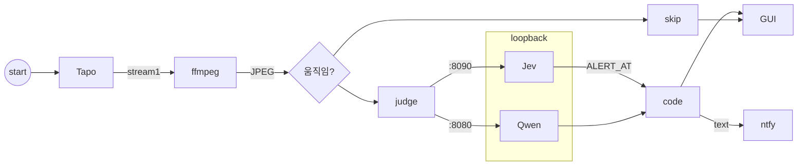

```mermaid
flowchart LR
  start((start)) --> Tapo
  Tapo -->|stream1| ffmpeg
  ffmpeg -->|JPEG| motion{움직임?}
  motion --> skip
  motion --> judge
  judge -->|:8090| Jev
  judge -->|:8080| Qwen
  Jev -->|ALERT_AT| code
  Qwen --> code
  code -->|text| ntfy
  code --> GUI
  skip --> GUI
  subgraph loopback
    Jev
    Qwen
  end
```

